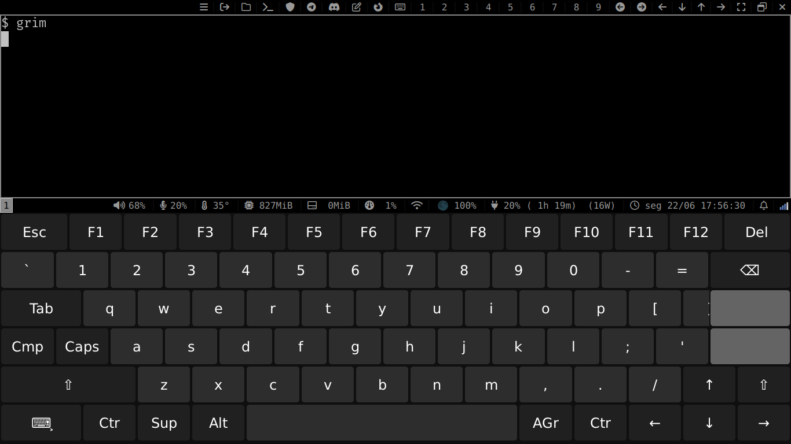
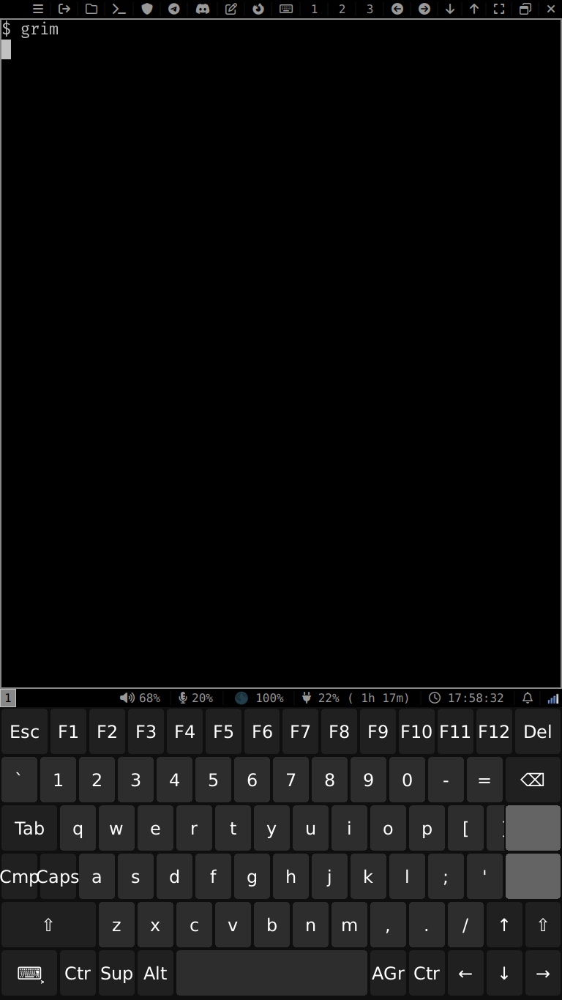

# dotfiles

## Sway

Sway comes with i3status-rs by default, with a "big" and "small" modes for tablet orientation, set by the autorotation script that was stolen from [here](https://codeberg.org/snonux/sway-autorotate) and [here](https://github.com/tedk0n/autorotate_sway_script). I have tried to create buttons for almost every sway function, but [wvkbd](https://git.sr.ht/~proycon/wvkbd) works for keybinds, so you can eliminate the top bar entirely if necessary.

| big  | small |
|-------|-----|
|  |   |

## wlogout

wlogout is configured for systems with elogind by default, nothing else is changed.

## wofi 

wofi was choosed instead of fuzzel since it supports touch controls (like scrolling), I still prefer fuzzel.
